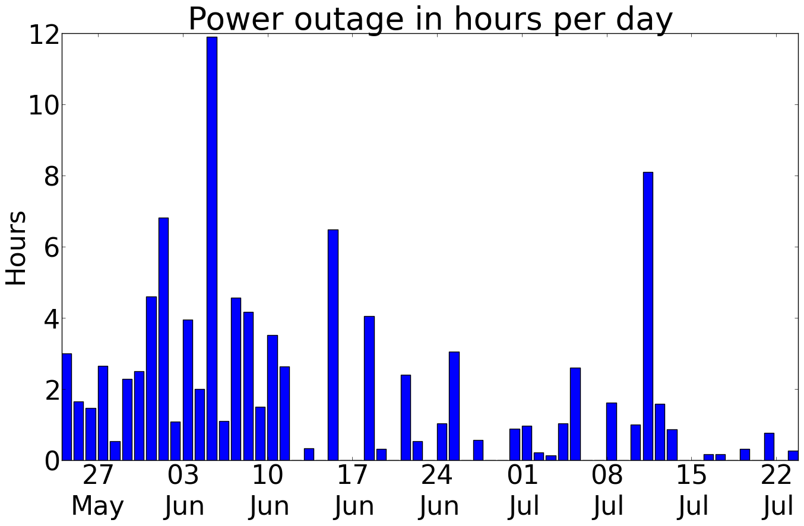

# IAWE -Indian Dataset for Ambient Water and Energy

Ehis repository unbundles the IAWE dataset with all the notebooks in Jupyter Notebook created with OZM v1, OZM v2 or OMPM.

In them we can study how NILMTK can be applied on the IAWE dataset, for example to compare the results obtained with other datasets, using also new algorithms or other measurement devices with other characteristics (different sampling frequencies, harmonic support, etc.).

Below we can see the detail of the IAWE dataset based on all the information available in the dataset repository at <https://iawe.github.io/>.

# IAWE Details

Indian environmental water and energy dataset. In the summer of 2013, a house was set up in New Delhi, India, with the aim of characterising the unique aspects of energy monitoring and consumption in India. In total they collected about 73 days of data.

Electricity was measured at all 3 levels:

- Electricity meter: Using the EM6400 sensor from Schneider Electric.
- Circuit panel
- Device level
- 

Power cuts are still common in India. Yes, even in Delhi. During the deployment, power cuts of up to 9 hours a day were observed.

Water supply is not available 24X7. In fact, it is usually only available for a few hours a day. To avoid this, almost everyone has an elevated reservoir where water is stored. They measured the volume of water flowing from the supply and use of the elevated tank.

What about the network? They noted that the Internet is not the most reliable. Packet loss is very common. We quantified it and found that up to 25% of parcels per day were lost.

How do they solve this packet drop? They introduce a notion of local storage in their architecture that also compensates for other failures.

# Sources:

1. Github repository: Take a look at their Github repository, which contains all the problems the repository creators faced and how they solved them. <https://iawe.github.io/>
2. What about the DB schemas? Right here(<https://github.com/nipunreddevil/Home_Deployment/tree/master/configuration/db_schemas> ). We make it easy for you to replicate such implementations.
3. IPython starter notebooks - why go to the trouble of coding from scratch? Start with your IPython notebooks that illustrate common functionalities: <http://nbviewer.ipython.org/github/nipunreddevil/Home_Deployment/tree/master/notebooks/>.
4. Metadata: Wouldn't it be useful to know the power rating of all devices, or which device is assigned to which circuit? Consult your metadata to find out more. <https://github.com/nipunreddevil/Home_Deployment/tree/master/configuration>
5. Why so many sensors? Take a look at <https://github-camo.global.ssl.fastly.net/d30aa5a421c900d1b2b55e5f863a5be0cc024b90/68747470733a2f2f646c2e64726f70626f7875736572636f6e74656e742e636f6d2f752f37353834353632372f4465706c6f796d656e742f6c6162656c5f616e6e6f74617465642e706e67> You will notice the additional value of adding up the sensor data.

# Miscellaneous questions about this dataset

**1. When examining the data at appliance level (3.csv, 4.csv, etc.) and comparing it with the mains data, it can be seen that the start time period of each appliance is different, e.g. the fridge starts on 7 June and the washing machine on 10 June, while the mains has data from 22 May**.

This is correct. They use jugs to collect data from appliances. The deployment of smart meters to collect data from the electricity grid started a few days before the collection of data from the different appliances. jPlugs collected data only when the appliance was switched on. Thus, the data from the washing machine starts on 10 June, the day it was used for the first time during data collection.

**2.What is the best start and end time to use the electricity data?** ** What is the best start and end time to use the electricity data?What is the best start and end time to use the electricity data?** ** What is the best start and end time to use the electricity data?

The HDF5 nilmtk I have created uses data between 13-7-2013 and 4-8-2013. This period has the maximum amount of sensor data available.

**3. Which pre-processing has been done in nilmtk HDF5?**

In the light of questions 1 and 2, the following pre-processing has been carried out in nilmtk HDF5:

1. 13-7-2013 and 4-8-2013 have been chosen as start and end dates.
2. Downsampling to a resolution of 1 minute.
3. Ignoring the water engine that does not have sufficient data in this time window.
4. Filled in with zeros where data was missing (this indicates that the appliance was not in use).
5. Made sure that all devices and both networks have the same amount of data.

**4. The document claims to have more data than it has provided on the dataset page.**

This is correct. They have post-processed the data some time after data collection. They found that:

1. the CT data is probably not very useful. This is due to the fact that there was interference between the different TCs and therefore nearby TCs report the same values, which is incorrect.
2. The phone data collected from FunF was huge in size. They thought the data collection was on the right track when we saw the huge amount of data being generated. However, during our post-processing, we discovered that FunF can produce tons of data even in one hour. In reality, the application had only been running for a very small period of time, so we don't think the data from the phone was very useful.
3. Some of the sensors failed in between, so their data was deleted.

**5. The difference between the sum of the appliances and the mains is very large (on average >350W).**

This is likely to happen. We have not monitored appliances that do not have a plug load, such as fans and lighting, which can draw up to 350 watts. The idea was to control them via CT at the MCB. However, as mentioned in question 4, this did not work. That said, nilmtk reports that around 74% of energy is under-measured, which is a good figure and comparable or better than many existing datasets.

**6. The NILMTK document says that the fraction of the total energy allocated is around 0.89, we are getting a different number..**

The NILMTK article was written when nilmtk was in version 0.1. Since then, nilmtk has changed. Since then, nilmtk has evolved. Various filtering procedures have also been applied. If exactly the same conditions are met, such as the same test-train split, etc., you should get the same numbers.

**7.The Ambient database is mainly composed of two different datasets, labelled as i) Light temp and ii) PIR. Both sets are presented in .csv file format. Light_temp.csv contains 4 columns, while PIR shows 2 columns. Is it possible to obtain information about these columns?**

- Light_temp.csv has the following four columns: timestamp, i) Light, light, temp. Here, timestamp is Unix epoch, node_id is the sensor id (from 2-7 where each sensor node is kept in a different room), light (light intensity on a scale of 0-100), temp (temperature in Fahrenheit).
- Pir.csv has the following two columns: timestamp, node_id Here node_id is the same as above. Here, a read means that in this node_id and timestamp movement was detected.

**8. During data collection, has any correlation between this environmental data set and electricity data been measured/observed?**

There is a very close relationship between environmental and electricity data. It has not yet been analysed in detail. However, the following figure (which is figure 11 of our paper describing the dataset) may be useful.

**9. The document refers to an annotated dataset, where can I find it?**

Here are the events of a specific day: <https://github.com/nipunreddevil/Home_Deployment/tree/master/dataset>Here are the events of a specific day: 

**10. In section 3.1 of the document, under the sub-section "Environmental monitoring", it is stated that data have been collected at a frequency of 1 Hz. If this is the case, we should get data every second. However, in the data archive the data has been dumped irregularly (i.e. not at the 1Hz rate) for both archives. Only for 4 August 2013, data have been collected at every 1 second..**

There are some limitations in the OpenZWave stack that is used for data collection. They had to hack the way to poll data from these sensors that would happen in a circular fashion. They configured the program to collect data at the fastest possible rate. However, the stack itself had some problems getting around this. That said, reducing the data sampling to something like 1 minute, using some feature such as maximum, minimum, median, etc. should be sufficient, since these environmental parameters do not really change much in the absence of events.
**11. Have sound sensors been placed in those 5 rooms?**

They use phones in all 5 rooms to collect data using the FunF diary. FunF generates a huge amount of data even for small time intervals. Not enough attention was paid to this and it was thought that the data collection had gone smoothly, which was not the case. As a result, when the data collected from the phones was analysed recently, it appeared to be useless and was therefore not made publicly available.
**12. ¿Are there negative timestamps in the data, and should we ignore that part and consider only the positive times?**

They can be safely ignored.

**13. In the electricity data, are the first two files, i.e. 1.csv and 2.csv (both have been marked as "mains" in the "label.dat" file) the same? I have opened the two files and found that their VLN and fs match on the same date and time, while there are differences between the respective columns. If my observations are correct, could you please tell us what and why these differences have occurred?**

The instrumented house had 2 meters installed by the electricity company. 1.csv and 2.csv correspond to these two meters. However, the frequency and voltage they measure is the same, as they both receive the same supply from the grid. These meters serve disjoint sets of loads within the dwelling. For example, the two DHWs are on different meters.

**14. From the image above (taken from your research paper), can we get information on which environment node is located in which room or near which appliances??**

The mapping between rooms and node id is here. <https://github.com/nipunreddevil/Home_Deployment/blob/master/configuration/multisensor.md>

Inside the room, it is necessary to look at the location of the multi-sensor to see which appliances are nearby. The large room on the ground floor is the room containing the TV. The small room on the ground floor does not contain any monitored appliances and is on the other side of the engine. The large room on the first floor contains AC and an electric iron. The small room on the first floor contains AC and a laptop computer.

**15. You see only five multi-sensors (Multi-sensors + Android phone combo) that are placed in 5 rooms. Is this correct?**

Correct. Node 5 broke and was therefore removed. Initially, it was planned to install it in the kitchen.

**16. Is the electricity data of "Geyser" taken into account because the "label.dat" file does not contain the name of Geyser? However, I think, jPlug is attached with the Geyser data to get the device level data. At the same time, in your document, you mention that during your deployment 3 jPlugs stopped working, is that the same reason why Geyser data has not been recorded?**

That's right. The geyser jPlug malfunctioned.

**17. Looking at water_meter.csv, you see multiple timestamps per second in some cases, which would be too fast for litre pulses, let alone 10-litre pulses. From what you see in iawe-website/mapping.py, the first column probably represents which counter is being recorded.**

There were problems with the collection of data from the water meters. So they discarded events that took place in a very short interval as false positives. I know it's not ideal, but they found no other way to solve this problem. The tank above was on the roof and they had to run a 12 foot cable down to a floor below, where they recorded the pulses on a Raspberry Pi. The graphs in this Github topic indicate that choosing a suitable time window and discarding multiple events during it was reasonable.

**18. From the looks of iawe-website/mapping.py the first column probably represents which counter is being recorded. What does the third column of zeros and ones represent??**

The third column of 0 or 1 represents whether an event is occurring or not. Previously, an interrupt-based mechanism had been used to record data where the third column was needed. Later, it was changed to polling and continued to use the same scheme.
**19. Ehe document also says that there is 1 day of fully labelled data for 18 water installations. Where can I find this data?**

The following link contains information on annotated events. <https://github.com/nipunreddevil/Home_Deployment/blob/master/dataset/ct_data_controlled.csv> For the 18 appliances, a metadata collection was made by opening an appliance in isolation for a certain time and annotating the water consumed in the domestic meter.

Aside: Have a look at Figure 9 at <http://arxiv.org/pdf/1404.7227v3.pdf> and the corresponding text. This figure shows the energy-to-water ratio of the engine. While turning on the water motor increases the pumping flow rate from 1 l/min to 20 l/min, it incurs an additional expenditure of 1 horsepower.

**20. In nipunbatra/Home_Deployment#24. Are events grouped according to their proximity? Looking at the farthest graph (the last of the three), it can be seen that from 15:30 to 16:00, events of half an hour's duration are clustered together. In a window of similar size, from 13:00 to 13:30, the events are separated into several different groupings. Where can this example be found in the data? Based on the comment, it is assumed to be 14 June 2013 but I don't know if GMT oryour local time is being used. What does the "Reading" column in the table mean?**

The way pulse-based meters work is that a pulse is sent if the reading module 1 is less than 0.1. Therefore, when that data is polled, it is possible that the water consumption has stopped at that point and the meter is still sending pulses. This is probably what is happening in the far graph. Local time (GMT +5.5 hours) is being used in the data collection. Therefore, the clustering only shows that there was no water consumption during that time. Or, to be more technically correct, the water consumption did not change by more than 0.1 times the meter resolution (1l or 10l for the different meters).

The table shows the reading in litres that was manually entered on the water meter.

**21. Is the dataset suitable for water disaggregation?**

In the light of the questions above, the answer is probably no.

