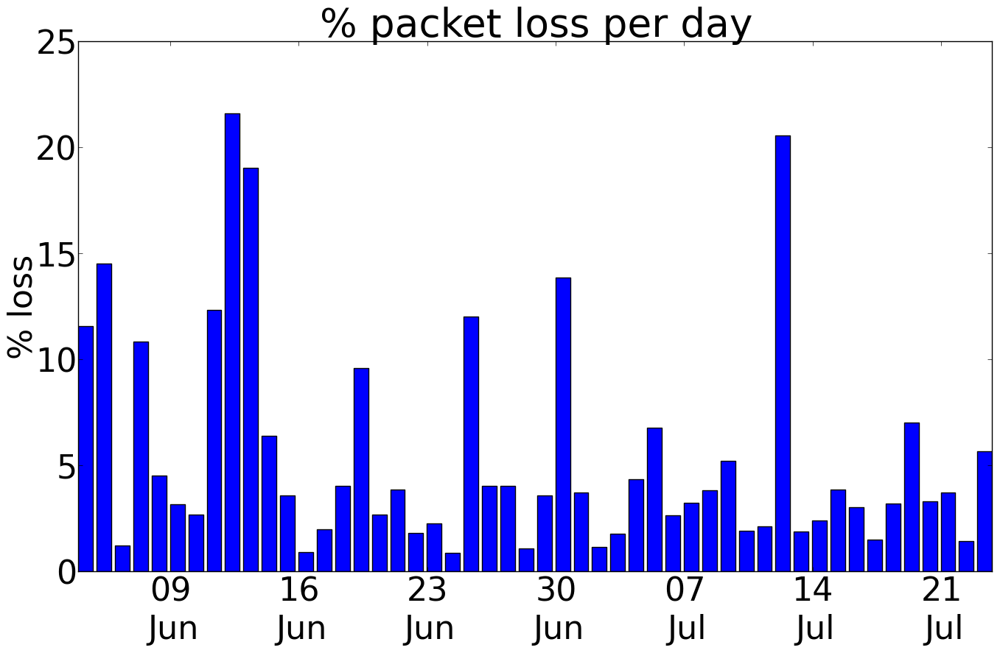

# ozm_vs_iawe

En este repositorio se desagrega el dataset IAWE con los todos los cuadernos en Jupyter Notebook creados  con  OZM v1, OZM v2 u OMPM.

En ellos podemos estudar  como se puede aplicar NILMTK  sobre el dataset IAWE, con fines por ejemplo, de poder comparar los resultados obtenidos con otros datasets, usando asimismo nuevos algoritmos  u otros dispositivos de medida con otras carastericticas ( diferentes frecuencias de muestreo, soporte de armonicos, etc.).

A continuación  podemos ver el detalle del dataset IAWE basandonos en toda la informacion del respositorio disponible del dataset en <https://iawe.github.io/> 

# IAWE -Indian Dataset for Ambient Water and Energy

Conjunto de datos indios sobre agua y energía ambiental. En el verano de 2013, se instrumenta una casa en Nueva Delhi, India, con el objetivo de caracterizar los aspectos únicos de la monitorización y el consumo de energía en la India. En total recogieron unos 73 días de datos.

La electricidad se midió en los 3 niveles:

-   Contador eléctrico: Utilización del sensor EM6400 de Schneider Electric
-   Panel del circuito
-   Nivel de aparatos

Los cortes de electricidad siguen siendo habituales en la India. Sí, incluso en Delhi. Durante el despliegue, se observaron cortes de electricidad de hasta 9 horas al día.

El suministro de agua no está disponible 24X7. De hecho, sólo suele estar disponible unas pocas horas al día. Para evitarlo, casi todo el mundo tiene un depósito elevado donde se almacena el agua. Midieron el volumen de agua que fluye desde el suministro y el uso del depósito elevado.

¿Qué pasa con la red? Observaron que Internet no es de lo más fiable. La pérdida de paquetes es muy común. Lo cuantificamos y descubrimos que se perdía hasta un 25% de paquetes al día.

¿Cómo resuelven esta caída de paquetes? Introducen una noción de almacenamiento local en su arquitectura que también compensa otros fallos.

# Fuentes:

1.  Repositorio de Github: Eche un vistazo a su repositorio de Github, que contiene todos los problemas a los que se enfrentaron los creadores del repositorio y cómo los resolvieran. <https://iawe.github.io/>
2.  ¿Y los esquemas de BD? Aquí mismo (<https://github.com/nipunreddevil/Home_Deployment/tree/master/configuration/db_schemas> ). Le facilitamos la replicación de este tipo de implantaciones.
3.  Cuadernos de inicio IPython. ¿Por qué tomarse la molestia de codificar desde cero? Empiece con sus cuadernos IPython que ilustran funcionalidades comunes: <http://nbviewer.ipython.org/github/nipunreddevil/Home_Deployment/tree/master/notebooks/>
4.  Metadatos: ¿No sería útil conocer la potencia nominal de todos los aparatos? ¿O qué aparato está asignado a qué circuito? Consulte sus metadatos para saber más. <https://github.com/nipunreddevil/Home_Deployment/tree/master/configuration>
5.  ¿Por qué tantos sensores? Eche un vistazo en <https://github-camo.global.ssl.fastly.net/d30aa5a421c900d1b2b55e5f863a5be0cc024b90/68747470733a2f2f646c2e64726f70626f7875736572636f6e74656e742e636f6d2f752f37353834353632372f4465706c6f796d656e742f6c6162656c5f616e6e6f74617465642e706e67> Se dará cuenta del valor adicional al sumar los datos de los sensores.

# Cuestiones varias sobre este dataset

**1. Cuando se examina los datos a nivel de electrodoméstico (3.csv, 4.csv, etc.) y los compara con los de la red eléctrica, se observa que el periodo de tiempo de inicio de cada electrodoméstico es diferente, por ejemplo, el frigorífico empieza el 7 de junio y la lavadora el 10 de junio, mientras que la red eléctrica tiene datos del 22 de mayo**.

Esto es correcto. Utilizan jugs para recopilar los datos de los aparatos. El despliegue de contadores inteligentes para recoger datos de la red eléctrica comenzó unos días antes de la recogida de datos de los distintos aparatos. jPlugs recogía datos sólo cuando el aparato estaba encendido. Así, los datos de la lavadora comienzan el 10 de junio, día en que se utilizó por primera vez durante la recogida de datos.

**2. ¿Cuál es la mejor hora de inicio y fin para utilizar los datos sobre electricidad?**

El HDF5 nilmtk que he creado utiliza datos entre el 13-7-2013 y el 4-8-2013. Este periodo tiene la máxima cantidad de datos de sensores disponibles.

**3. ¿Qué preprocesamiento se ha hecho en nilmtk HDF5?**

A la luz de las preguntas 1 y 2, se ha realizado el siguiente preprocesamiento en nilmtk HDF5:

1.  Se han elegido como fechas de inicio y fin el 13-7-2013 y el 4-8-2013.
2.  Reducción de la muestra a una resolución de 1 minuto
3.  Se ignora el motor de agua que no tiene suficientes datos en esta ventana de tiempo
4.  Rellenado con ceros los espacios en los que faltaban datos (esto indica que el aparato no se estaba utilizando).
5.  Se ha asegurado de que todos los aparatos y las dos redes tengan la misma cantidad de datos.

**4. El documento afirma tener más datos de los que ha proporcionado en la página del conjunto de datos.**

Esto es correcto. Se ha postprocesado los datos un tiempo después de la recogida de datos. Encontraron que:

1.  Los datos del TC probablemente no sean muy útiles. Esto se debe al hecho de que hubo interferencias entre los diferentes CTs y por lo tanto los CTs cercanos reportan los mismos valores, lo cual es incorrecto.
2.  Los datos telefónicos recogidos de FunF tenían un tamaño enorme. Pensaron que la recopilación de datos iba por buen camino cuando vimos la enorme cantidad de datos que se generaban. Sin embargo, durante nuestro postprocesamiento, descubrimos que FunF puede producir toneladas de datos incluso en una hora. En realidad, la aplicación sólo se había ejecutado durante un periodo de tiempo muy pequeño, por lo que no creemos que los datos del teléfono fueran muy útiles.
3.  Algunos de los sensores fallaron entre medias, por lo que eliminaron sus datos.

**5. La diferencia entre la suma de los electrodomésticos y la red eléctrica es muy grande (de media \>350W)**

Es probable que esto ocurra. No hemos supervisado los aparatos que no tienen carga de enchufe, como ventiladores e iluminación, que pueden consumir hasta 350 vatios. La idea era controlarlos mediante TC en el magnetotérmico. Sin embargo, como se menciona en la pregunta 4, esto no funcionó. Dicho esto, nilmtk informa de que alrededor del 74% de la energía está submedida, lo cual es una buena cifra y comparable o mejor que muchos conjuntos de datos existentes.

**6. El documento NILMTK dice que la fracción de la energía total asignada es de alrededor de 0,89, estamos recibiendo un número diferente.**

El artículo de NILMTK se escribió cuando nilmtk estaba en la versión 0.1. Desde entonces, nilmtk ha cambiado. Desde entonces, nilmtk ha evolucionado. También se han aplicado varios procedimientos de filtrado. Si se cumplen exactamente las mismas condiciones, como la misma división prueba-tren, etc., debería obtener los mismos números.

**7.La base de datos Ambient se compone principalmente de dos conjuntos de datos diferentes, etiquetados como i) Light temp y ii) PIR. Ambos conjuntos se presentan en formato de archivo .csv. Light_temp.csv contiene 4 columnas, mientras que PIR muestra 2 columnas. ¿Es posible obtener información sobre estas columnas?**

-   Light_temp.csv tiene las siguientes cuatro columnas: timestamp, i) Light, light, temp. Aquí, timestamp es Unix epoch, node_id es el id del sensor (de 2-7 donde cada nodo sensor se mantiene en una habitación diferente), light (intensidad de la luz en una escala de 0-100), temp (temperatura en Fahrenheit)
-   Pir.csv tiene las dos columnas siguientes: timestamp, node_id Aquí node_id es el mismo que en el caso anterior. Aquí, una lectura significa que en este node_id y timestamp se detectó movimiento.

**8. Durante la recogida de datos, ¿se ha medido/observado algún tipo de correlación entre este conjunto de datos ambientales y los datos de electricidad?**

Existe una relación muy estrecha entre los datos ambientales y los de electricidad. Aún no se ha analizado en detalle. Sin embargo, la siguiente figura (que es la figura 11 de nuestro documento en el que se describe el conjunto de datos) puede ser útil.

**9. En el documento se habla de un conjunto de datos anotados. ¿Dónde puedo encontrarlo?**

Aquí los acontecimientos de un día concreto: <https://github.com/nipunreddevil/Home_Deployment/tree/master/dataset>

**10. En el apartado 3.1 del documento, bajo el subapartado "Vigilancia ambiental", se dice que los datos se han recogido a una frecuencia de 1 Hz. Si es así, deberíamos obtener datos cada segundo. Sin embargo, en el archivo de datos que los datos se han volcado de forma irregular (es decir, no a la tasa de 1Hz tasa) para ambos archivos. Sólo para el 4 de agosto de 2013, los datos han sido recogidos en cada 1 segundo.**

Hay algunas limitaciones en la pila OpenZWave que se utiliza para la recogida de datos. Hubo que hackear la manera de sondear los datos de estos sensores que sucedería de una manera circular. Configuraron el programa para recoger datos a la velocidad más rápida posible. Sin embargo, la propia pila tenía algunos problemas para evitarlo. Dicho esto, reducir el muestreo de datos a algo así como 1 minuto, utilizando alguna característica como máximo, mínimo, mediana, etc. debería ser suficiente, dado que estos parámetros ambientales en realidad no cambian mucho en ausencia de eventos.

**Pregunta 11. ¿Se han colocado sensores de sonido en esas 5 habitaciones?**

Usan teléfonos en las 5 habitaciones para recoger datos usando el diario FunF. FunF genera una enorme cantidad de datos incluso para pequeños intervalos de tiempo. No se prestó suficiente atención a esto y se pensó que la recogida de datos se había realizado sin problemas, lo que no era el caso. Como resultado, cuando se analizó los datos recogidos de los teléfonos recientemente, pareció que eran inútiles y por eso no se puso a disposición del público.

**12. ¿Hay marcas de tiempo negativas en los datos? ¿Deberíamos ignorar esa parte y considerar sólo las épocas positivas?**

Se pueden ignorar sin problemas.

**13. En los datos de electricidad, ¿son iguales los dos primeros archivos, es decir, 1.csv y 2.csv (ambos se han marcado como "mains" en el archivo "label.dat")? He abierto los dos archivos y he comprobado que sus VLN y fs coinciden en la misma fecha y hora, mientras que hay diferencias entre las columnas respectivas. Si mis observaciones son correctas, ¿podría indicarnos qué y por qué se han producido esas diferencias?**

La casa instrumentada tenía 2 contadores instalados por la compañía eléctrica. 1.csv y 2.csv corresponden a estos dos contadores. Ahora bien, la frecuencia y la tensión que miden es la misma, ya que ambos reciben el mismo suministro de la red. Estos contadores atienden a conjuntos disjuntos de cargas dentro de la vivienda. Por ejemplo, los dos Acs están en contadores diferentes.

**14. De la imagen anterior (tomada de su artículo de investigación), ¿podemos obtener información sobre qué nodo de ambiente está situado en qué habitación o cerca de qué electrodomésticos?**

El mapeo entre habitaciones e id de nodo está aquí. <https://github.com/nipunreddevil/Home_Deployment/blob/master/configuration/multisensor.md>

Dentro de la habitación, es necesario ver la ubicación del multisensor para ver qué electrodomésticos están cerca. La habitación grande de la planta baja es la habitación que contiene el televisor. La habitación pequeña de la planta baja no contiene ningún aparato monitorizado y está al otro lado del motor. La habitación grande de la primera planta contiene CA y una plancha eléctrica. La habitación pequeña de la primera planta contiene CA y un ordenador portátil.

**15. Se ven sólo cinco multi-sensores (Multi-sensores + Android teléfono combo) que se colocan en 5 habitaciones. ¿Es correcto?**

Correcto. Nodo \# 5 se rompió y por lo tanto fue retirado. Inicialmente, se había planeado instalarlo en la cocina.

**16. ¿Se tienen en cuenta los datos de electricidad de "Geyser" porque en el archivo "label.dat" no aparece el nombre de Geyser? Sin embargo, creo que, jPlug se adjunta con los datos de Geyser para obtener los datos a nivel de aparato. Al mismo tiempo, en su documento, usted menciona que durante su despliegue 3 jPlugs dejaron de funcionar, ¿es esa la misma razón por la que los datos de Geyser no se han registrado?**

Es cierto. El jPlug del géiser funcionó mal.

**17. Mirando water_meter.csv, se ven múltiples marcas de tiempo por segundo en algunos casos, lo que sería demasiado rápido para pulsos de litros, y mucho menos pulsos de 10 litros. Por lo que se ve en iawe-website/mapping.py, la primera columna probablemente representa qué contador se está registrando.**

Se Tuvo problemas con la recogida de datos de los contadores de agua. Por lo que se descartaron eventos que tuvieron lugar en un intervalo muy corto por ser falsos positivos. Sé que no es lo ideal, pero no encontraron otra forma de resolver este problema. El tanque de arriba estaba en la azotea y se tuvo que ejecutar un cable de 12 pies hasta un piso de abajo, donde se registran los pulsos en una Raspberry Pi. Los gráficos en este tema de Github indican que elegir una ventana de tiempo adecuada y descartar múltiples eventos durante la misma era razonable.

**18. Por el aspecto de iawe-website/mapping.py la primera columna probablemente representa qué contador se está registrando. ¿Qué representa la tercera columna de ceros y unos?**

La tercera columna de 0 o 1 representa si se está produciendo un evento o no. Anteriormente, se había utilizado un mecanismo basado en interrupciones para registrar los datos donde se necesitaba la tercera columna. Más tarde, se cambió a polling y se continúo utilizando el mismo esquema.

**19. El documento también dice que hay 1 día de datos totalmente etiquetados para 18 instalaciones de agua. ¿Dónde se puedo encontrar estos datos?**

El siguiente enlace contiene información sobre eventos anotados. <https://github.com/nipunreddevil/Home_Deployment/blob/master/dataset/ct_data_controlled.csv> En cuanto a los 18 aparatos, se hizo una recopilación de metadatos en la que abría un aparato de forma aislada durante un tiempo determinado y anotaba el agua consumida en el contador doméstico.

Aparte: Eche un vistazo a la Figura 9 en <http://arxiv.org/pdf/1404.7227v3.pdf> y al texto correspondiente. Esta figura muestra la relación energía-agua del motor. Si bien al encender el motor de agua se aumenta el caudal de bombeo de 1 l/min a 20 l/min, se incurre en un gasto adicional de 1 caballo de potencia.

**20. En nipunbatra/Home_Deployment\#24. ¿Se agrupan los eventos en función de su proximidad? Observando el gráfico más alejado (el último de los tres), se ve que desde las 15:30 hasta las 16:00 se agrupan eventos de media hora de duración. En una ventana de tamaño similar, de 13:00 a 13:30, los sucesos están separados en varias agrupaciones diferentes. ¿Dónde se puede encontrar este ejemplo en los datos? Basándose en el comentario, se asume que es el 14 de junio de 2013 pero no sé sabe si se está usando GMT o su hora local. ¿Qué significa la columna "Lectura" en la tabla?**

La forma en que funcionan los medidores basados en pulsos es que se envía un pulso si el módulo de lectura 1 es inferior a 0,1. Por lo tanto, cuando se sonden esos datos, es posible que el consumo de agua se haya detenido en ese punto y el contador siga enviando pulsos. Esto es probablemente lo que ocurre en el gráfico más alejado. Se está utilizando la hora local (GMT +5,5 horas) en la recogida de datos. Por lo tanto, la agrupación sólo muestra que no hubo consumo de agua durante ese tiempo. O, siendo más técnicamente correcto, el consumo de agua no cambió en más de 0,1 veces la resolución del contador (1l o 10l para los diferentes contadores).

La tabla muestra la lectura en litros que se anotó manualmente en el contador de agua.

**21. ¿Es el conjunto de datos adecuado para la desagregación del agua?**

A la luz de las preguntas anteriores, la respuesta es probablemente no.

